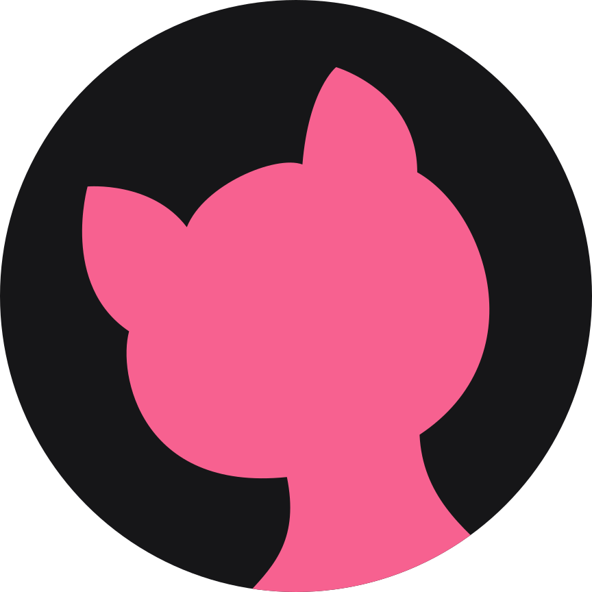

<!-- markdownlint-disable-next-line -->
<p align="center">
  
</p>

<h1 align="center">Lopes UI</h1>

**Lopes UI** é uma biblioteca de componentes React acessíveis e testados baseados no Lopes Design System, idealizado pelo desenvolvedor criativo [Marcello Lopes](https://github.com/marcell0lopes) .

- [_Lopes Design System_](https://lopes-ui.github.io/lopes-ui/) contempla componentes acessíveis utilizando _primitives_ do [Radix UI](https://github.com/radix-ui/primitives) e estilizados com [Stitches](https://github.com/stitchesjs/stitches)

## Instalação

### React

Lopes UI está disponível como um [pacote npm](https://www.npmjs.com/package/@lopes-ui/react).

**npm:**

```sh
npm install @lopes-ui/react
```

**yarn:**

```sh
yarn add @lopes-ui/react
```

## Começando com o Lopes UI

Aqui está um exemplo básico de como utilizar um componente básico React **Lopes UI**

```jsx
import * as React from "react";
import Button from "@lopes-ui/react";
function App() {
  return <Button color="secondary">Hello World</Button>;
}
```

In the interactive demo below, try changing the code and see how it affects the output.
(Hint: change `variant` to `"outlined"` and `color` to `"secondary"`.
For more options, see the [`Button` component page](https://mui.com/material-ui/react-button/) in our docs.)

[](https://codesandbox.io/s/lopes-ui-t0qjmw)

## Documentation

- [Lopes UI](https://lopes-ui.github.io/lopes-ui/)
